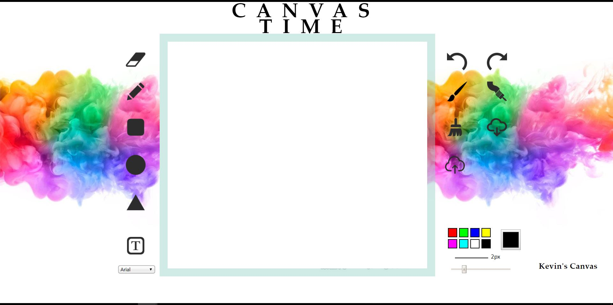
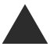
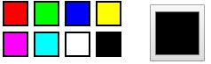
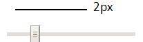
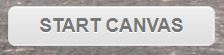

# Software Studio 2018 Spring Assignment 01 Web Canvas

## Web Canvas
</img>

## Todo
1. **Fork the repo ,remove fork relationship and change project visibility to public.**
2. Create your own web page with HTML5 canvas element where we can draw somethings.
3. Beautify appearance (CSS).
4. Design user interaction widgets and control tools for custom setting or editing (JavaScript).
5. **Commit to "your" project repository and deploy to Gitlab page.**
6. **Describing the functions of your canvas in REABME.md**

## Scoring (Check detailed requirments via iLMS)

|                       **Item**                   | **Score** |
|:--------------------------------------------:|:-----:|
|               Basic components               |  60%  |
|                 Advance tools                |  35%  |
|            Appearance (subjective)           |   5%  |
| Other useful widgets (**describe on README.md**) | 1~10% |

## Reminder
* Do not make any change to our root project repository.
* Deploy your web page to Gitlab page, and ensure it works correctly.
    * **Your main page should be named as ```index.html```**
    * **URL should be : https://[studentID].gitlab.io/AS_01_WebCanvas**
* You should also upload all source code to iLMS.
    * .html or .htm, .css, .js, etc.
    * source files
* **Deadline: 2018/04/05 23:59 (commit time)**
    * Delay will get 0 point (no reason)
    * Copy will get 0 point
    * "屍體" and 404 is not allowed
    
----------------------------------------------------------------------------------------------

#My functions of my canvas<br>

開始-前景圖片<br>
</img><br>
<br>

使用畫面<br>
</img><br>


1. </img>橡皮擦<br>

2. </img>鉛筆<br>

3. </img>正方形筆刷<br>

4. </img>圓形筆刷<br>

5. </img>三角形筆刷<br>

6. </img>輸入文字<br>

7. </img> Undo<br>

8. </img> Redo<br>

9. </img>圓形筆觸 (選鉛筆 然後粗細條大一點 可以看出來)<br>

10. </img>方形筆觸 (選鉛筆 然後粗細條大一點 可以看出來)<br>

11. </img>清除<br>

12. </img>下載檔案

13. </img>上傳檔案<br>

14. </img>    facebook<br>

15. </img>  文字字形<br>

16. </img>  調色盤<br>

17. </img>  文字畫筆粗細<br>

18. </img>  開始canvas按鈕<br>


