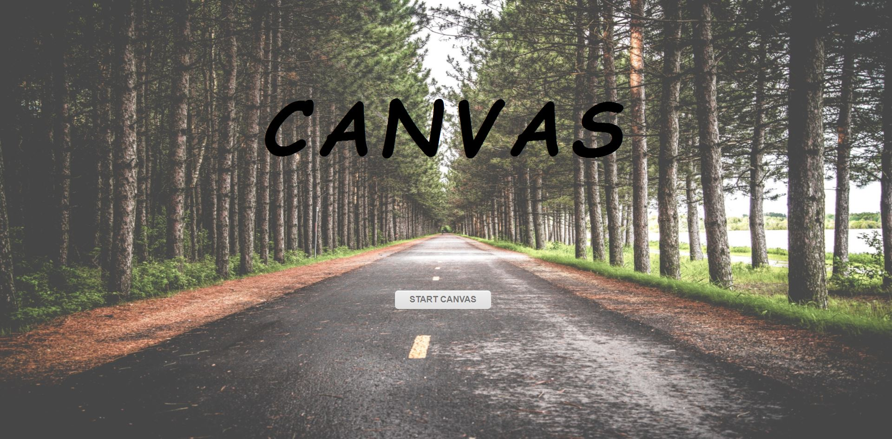
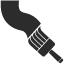
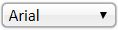

## Report 
---
## My functions of my canvas 

開始-前景圖片 
</img> 
 

使用畫面 
</img> 

1. </img>橡皮擦 

2. </img>鉛筆 

3. </img>正方形筆刷 

4. </img>圓形筆刷 

5. </img>三角形筆刷 

6. </img>輸入文字 

7. </img> Undo 

8. </img> Redo 

9. </img>圓形筆觸 (選鉛筆 然後粗細條大一點 可以看出來) 

10. </img>方形筆觸 (選鉛筆 然後粗細條大一點 可以看出來) 

11. </img>清除 

12. </img>下載檔案

13. </img>上傳檔案 

14. </img>    facebook 

15. </img>  文字字形 

16. </img>  調色盤 

17. </img>  文字畫筆粗細 

18. </img>  開始canvas按鈕 

------------------------------

1. function init() 

    製造出畫布給定長寬，取到canvas的ctx，然後把canvas塗白

2. function clearPad()

    清除掉canvas上面的畫(其實clear然後在讓它塗一層全白)

3. function circlef() , function squaref()

    圓形和正方形的筆觸

4. function cPush() cUndo() cRedo()

    在前面宣告一個陣列和step　每當按下滑鼠移動後，提起時呼叫cPush() 
    就把當下canvas圖案存進陣列，而Undo Redo 就是從陣列裡提出圖案印回canvas上

5. function readImage()

    把上傳的檔案印上去canvas

6. function chooseTool(name) , function chooseShape(name)

    選擇工具 然後再呼叫對應的function
    然後再透過 
     $('canvas').css('cursor', 'url(' + link + '), auto'); 
    當按下工具的時候 我的鼠標就會變成當下的工具

7. function chooseColor(id)

    選擇當下所按的顏色

8. function changeThickness(value)

    選擇當下所條的粗度

9. function handleToolDown(e) , function handleToolUp(e),  function handleToolMove(e)

    偵測滑鼠按下，移動，和提起。

10. function RGBtoHex(rgb), function HextoRGB(hex)

    轉換顏色

11. function addInput(x, y) ,  function handleEnter(e)   function drawText(txt, x, y), function change_font(f)

    依序是當按下畫面會出現文字輸入框，然後按enter的時候會消失 傳給drawtext 然後drawtext會畫出文字在canvas上 最後一個則是更換字體

12. function handleShapeDown(e),  function handleShapeUp(e)   function handleShapeMove(e), function createShape(point)

    依序是當工具選的是畫shape的時候的按下，移動，跟提起，最後一個是製造出那個shape。

13. class Rectangle extends Shape class Equilateral extends Shape class Ellipse extends Shape

    分別是畫出正方形的shape 三角形的shape 和 圓形的shape

14. function download()

    下載當下的圖片

15. function test1()

    由於上傳圖片原本是用選擇檔案的那個框框，不過為了要使用圖片來美化 
    所以用了這個function，就是我把選擇檔案的button隱藏，然後放置一個圖片，當我點擊圖片的時候會呼叫　test1() 裡面會對上傳檔案的那個物件做click 就可以達成我要的外觀效果。

16.  

    $(document).ready(function(){
    $("button").click(function(){
        $("#animal").css('z-index', -1);
        $("#headtext").css('z-index', -2);
        $("#test11").css('z-index', -2);
        $("#animal").animate({
        opacity : '0',
    });
    $("#test11").animate({
        opacity : '0',
    });
    $("#headtext").animate({
        opacity : '0',
    });
    });
    });

    這個是為了放置前景圖片 (就是按start　canvas才會開始的那個頁面) 
    這個使用到了z-index opacity 還有jquery的 animate  
    當我按下start的 button的時候 我會將 button 還有 背景圖片的z_index都設成負數(我body的z-index是0)。 然後透明度調成完全透明

    所以其實並不是跳成另一個頁面，而是我只是把圖片跟按鈕弄成透明然後放到畫布的後面，就可以達到切換頁面的效果!!!

